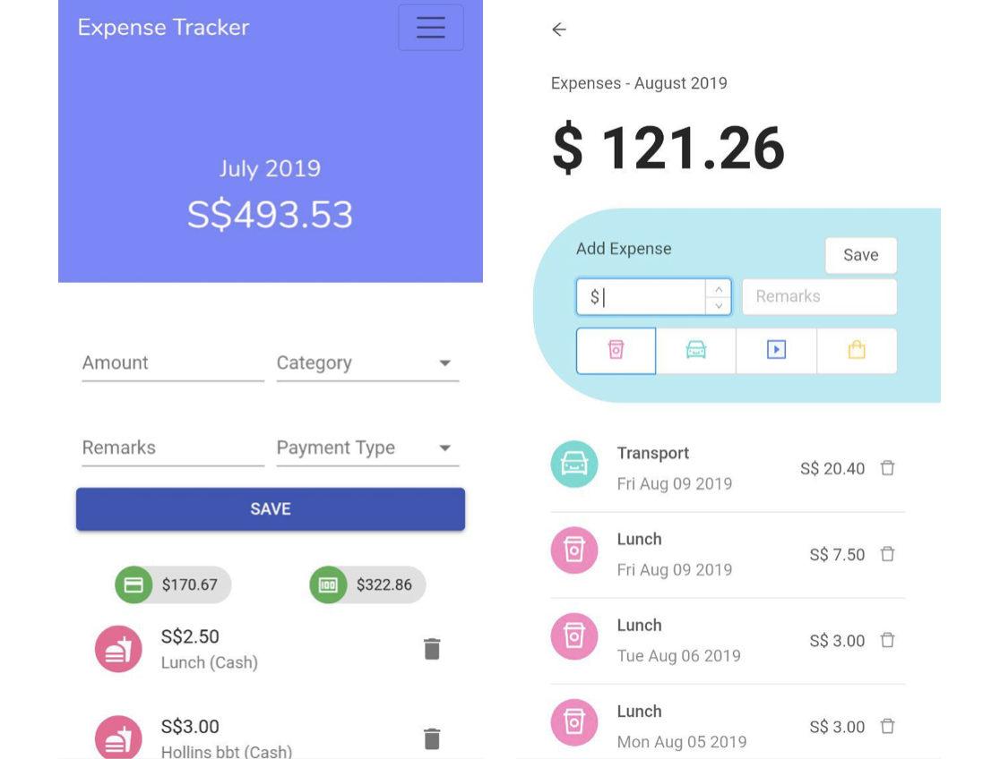
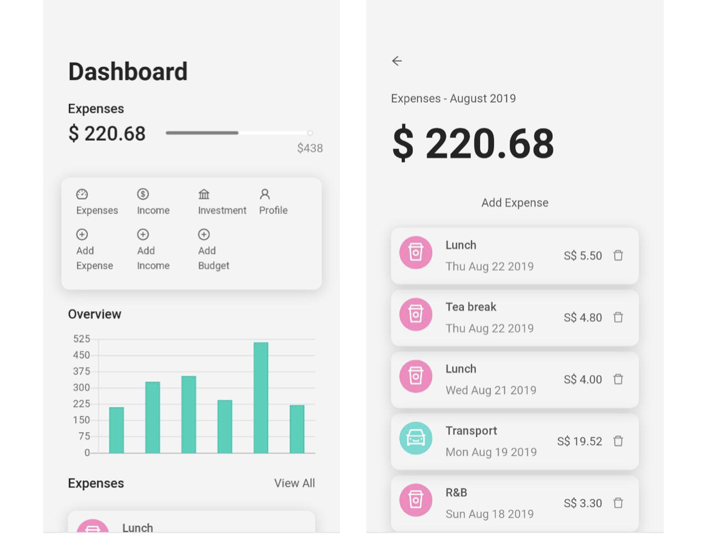

[Expense Tracker Site](http://imma-save-more-money.netlify.app/) is live! You can track your expenses, income and investments here.

This project was bootstrapped with [Create React App](https://github.com/facebookincubator/create-react-app) and utilizes [Ant Design](https://ant.design/) UI Framework.


### Project Architecture
- ReactJS Frontend and Backend
- Firebase Real Time Database
- Deployment, CI/CD: Netlify (Commit to push will trigger build on netlify)

### Updates to UI 
Changed from Google's Material UI theme to Ant Design, with a focus on mobile first. [Read more here.](https://blog.rongying.co/babble/2019/08/23/Revisiting-Expense-Tracker/)


###### Old design was a bit tacky but I put up with it cos it was still functional xD



###### New design! Hopefully it will last longer.

## Contributing

### Setup

Running Expenses Tracker requires a Firebase project. The Firebase project should contain a Web app.

You need the Firebase configuration variables for your Web app, which are provided when you create
the Web app as well as under Project Settings -> Your apps. These are passed into the application
using environment variables. One way to set them is using a `.env.local` file like this:

```
REACT_APP_STAGING_API_KEY=xxx
REACT_APP_STAGING_AUTH_DOMAIN=xxx
REACT_APP_STAGING_DATABASE_URL=xxx
REACT_APP_STAGING_PROJECT_ID=xxx
REACT_APP_STAGING_STORAGE_BUCKET=xxx
REACT_APP_STAGING_MESSAGING_SENDER_ID=xxx
REACT_APP_STAGING_APP_ID=xxx
```

Expenses Tracker currently only supports logging in with Google, so your project should have the
Google sign-in provider enabled. You can enable it from the Firebase console under Develop ->
Authentication -> Sign-in method.

Firebase Realtime Database needs to be enabled. You need to set the database rules under Develop ->
Database -> Realtime Database -> Rules. The following set of rules will allow users to access only
their own data:

```json
{
  "rules": {
    "users": {
      "$uid": {
        ".read": "$uid === auth.uid",
        ".write": "$uid === auth.uid"
      }
    }
  }
}
```

After everything is set up, you can run Expenses Tracker locally using `npm start`.
