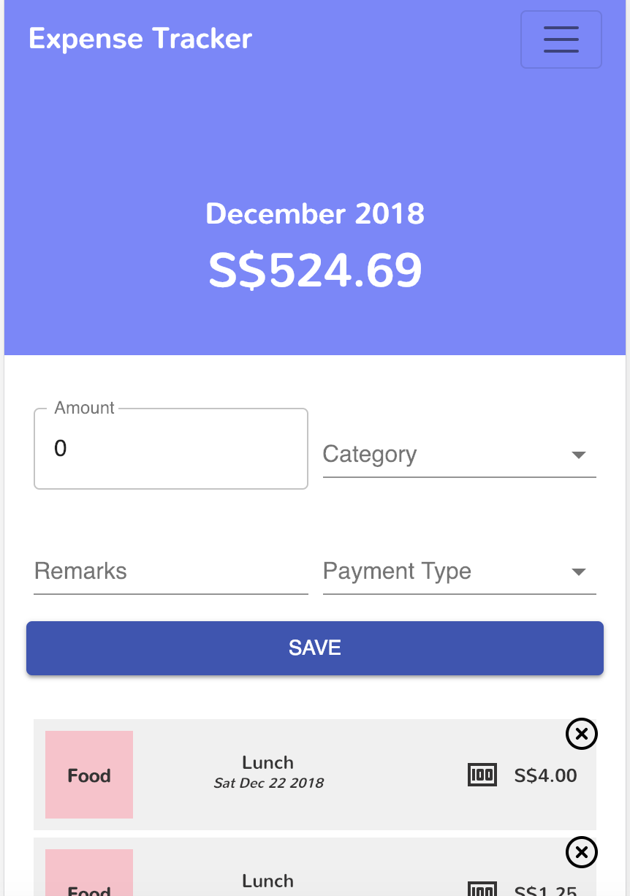

[Site](http://imma-save-more-money.netlify.com/) is live! You can track your expenses, income (and soon investments!) here :) 

This project was bootstrapped with [Create React App](https://github.com/facebookincubator/create-react-app).

### todo:
- [x] Expenses - add payment form
- [x] Material UI - Lists for expense list
- [x] Home - group by card or cash 
- [x] Material UI - Chip for card/cash
- [ ] Material UI - Expansion Panel for History
- [ ] History - show breakdown of expenses, savings and investments
- [ ] History - show graph of expenses (across month, across categories)
- [x] Income - add monthly and extra income 
- [ ] Investments - add monthly and extra investments 

Tutorial: https://css-tricks.com/intro-firebase-react/
 
### To deploy: 
git push to master and it will trigger a build on netlify 
Deploys to netlify automatically.

### Updates to UI 

